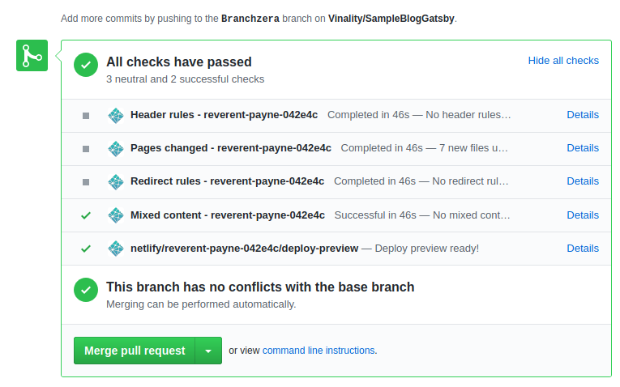
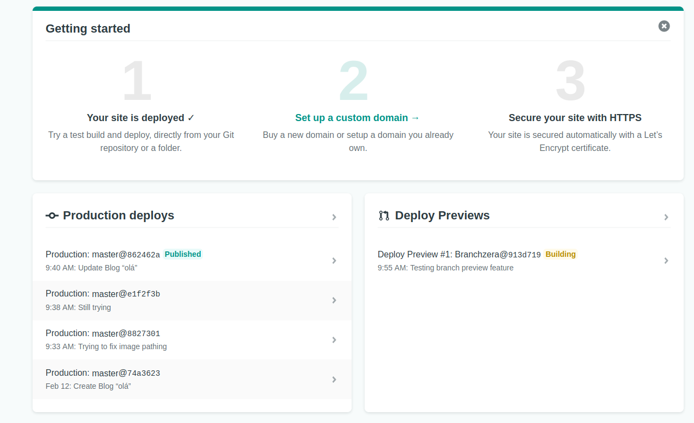
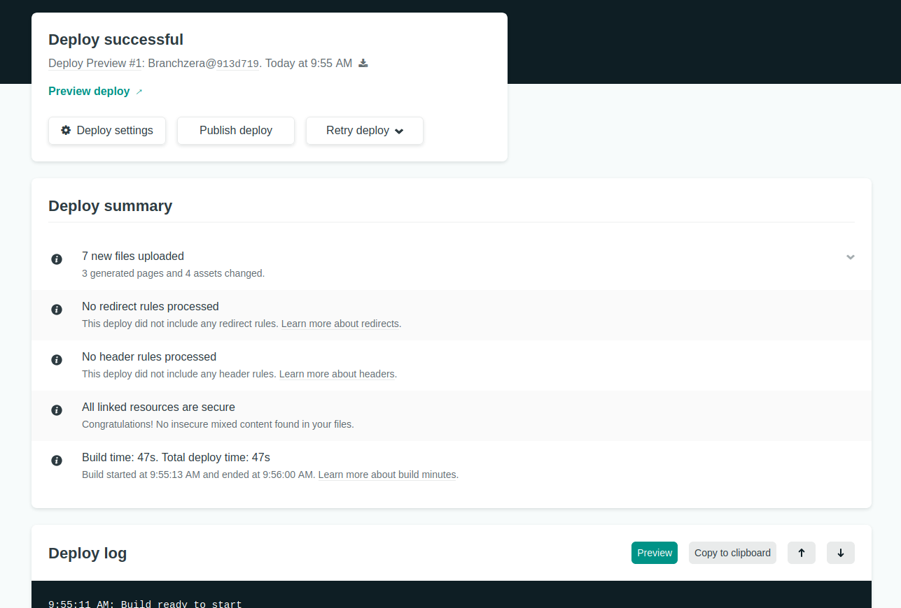

Ao fazer uma mudança em uma aplicação publicada pelo Netlify é possível visualizar uma versão de prévia do Pull Request antes de realizar um Merge para a Master. Dessa forma podemos testar as mudanças antes de coloca-las em produção.

Ao abrir um Pull Request no repositório, o Netlify começa a fazer algumas checagens automáticas e, em seguida, cria uma versão prévia da aplicação na dashboard.

## Abrindo um PR

Observe que na dashboard do Netlify agora temos uma versão de prévia da aplicação antes do merge:

## Testando a aplicação pelo modo prévia

Selecionando o Deploy Preview disponível podemos usar o botão preview para visualizar a versão de teste do nosso PR: 

Após testarmos e termos certeza de que está tudo certo, basta submeter o merge para produção :)
